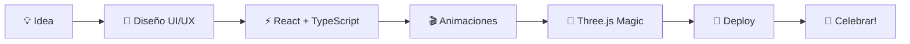

# 👋 ¡Hola! Soy un Senior Frontend Developer

<div align="center">
  
</div>

<br/>

<div align="center">
  
  
  
</div>

---

## 🎨 Sobre Mí

```typescript
const developer = {
  name: "Senior Frontend Developer",
  role: "Arquitecto de Experiencias Digitales",
  location: "🌍 Remoto / Presencial",
  passion: ["Three.js", "React", "Animaciones", "UI/UX"],
  philosophy: "El código es arte, y el navegador es mi lienzo"
}
```

Soy un desarrollador apasionado por crear interfaces que no solo funcionan, sino que **viven**. Especializado en experiencias 3D interactivas, animaciones fluidas y arquitecturas frontend escalables.

---

## 🛠️ Tech Stack & Herramientas

### 🎯 Frontend Core


### 🚀 Frameworks & Libraries


### 🔧 Backend & DevOps


### 🗄️ Bases de Datos


### 📱 Mobile


---

## 💎 Habilidades Blandas (Soft Skills)

<div align="center">

| 🎯 Habilidad | 📊 Nivel | 💡 Descripción |
|:---:|:---:|:---|
| 🧠 **Resolución de Problemas** | ██████████ | Encuentro soluciones elegantes a desafíos complejos |
| 🗣️ **Comunicación** | ██████████ | Traduzco conceptos técnicos para cualquier audiencia |
| 👥 **Trabajo en Equipo** | ██████████ | Colaboro sin egos, el código es lo primero |
| 🎨 **Creatividad** | ██████████ | Transformo ideas abstractas en experiencias tangibles |
| ⏰ **Gestión del Tiempo** | █████████░ | Entrego a tiempo sin sacrificar calidad |
| 🔄 **Adaptabilidad** | ██████████ | Me adapto rápido a nuevas tecnologías y metodologías |
| 🎯 **Atención al Detalle** | ██████████ | Código limpio, UI pixel-perfect, cero bugs olvidados |
| 🚀 **Liderazgo Técnico** | ████████░░ | Guío equipos hacia mejores prácticas y arquitectura |

</div>

---

## 📊 Estadísticas de GitHub

<div align="center">
  
  
</div>

<div align="center">
  
</div>

---

## 🐍 La Serpiente Come Commits

<div align="center">
  
</div>

---

## 🚀 Proyecto Destacado: Portafolio 3D Interactivo

<div align="center">
  
</div>

### ✨ Características

- 🎨 **Diseño Futurista** - Glassmorphism y efectos visuales modernos
- 🌌 **Fondo 3D Interactivo** - Partículas animadas con Three.js
- 🎬 **Animaciones Fluidas** - Transiciones suaves con Anime.js
- 📱 **Totalmente Responsive** - Se adapta a cualquier dispositivo
- ⚡ **Ultra Rápido** - Powered by Vite + React 19
- 🎯 **Scroll Reveal** - Animaciones al hacer scroll
- 📊 **Sección de Stats** - Habilidades y experiencia visual
- 📧 **Formulario de Contacto** - Conecta directamente

---

## 🏆 Logros & Certificaciones

<div align="center">

🥇 **Senior Frontend Developer** - 5+ años de experiencia  
🎨 **Especialista en Three.js** - Creando experiencias WebGL  
⚡ **React Expert** - Arquitecturas escalables  
🚀 **Performance Guru** - Lighthouse 100/100  

</div>

---

## 📫 Conecta Conmigo

<div align="center">

[](https://tu-portafolio.com)
[](https://github.com/YOUR_USERNAME)
[](https://linkedin.com/in/YOUR_USERNAME)
[](mailto:tu-email@example.com)

</div>

---

## 🎵 Mi Workflow



---

## 💭 Frase del Día

<div align="center">
  
</div>

---

## 🎯 Objetivos 2026

- [x] Crear portafolio 3D impresionante
- [ ] Contribuir a proyectos open source de Three.js
- [ ] Dar charlas sobre WebGL y animaciones web
- [ ] Mentorizar desarrolladores junior
- [ ] Aprender WebGPU y shaders avanzados

---

<div align="center">
  
  
  <br/>
  
  <b>⚡ "El código es como el humor. Cuando tienes que explicarlo, es malo." - Cory House</b>
  
  <br/>
  <br/>
  
  
  <i>Hecho con ❤️ y mucho ☕ en TypeScript</i>
  
</div>

---

<div align="center">
  <sub>🚀 Portafolio creado con React + Three.js + Anime.js | © 2026</sub>
</div>
